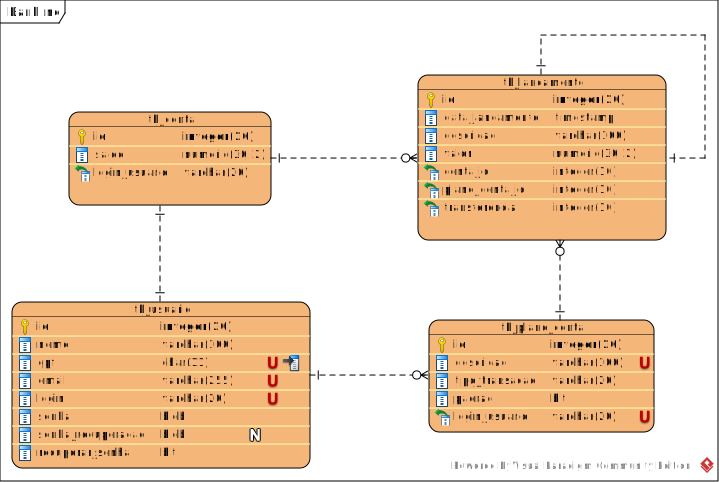

  
 ## <h2> Entrega em grupo - Projeto Final Java</h2>

  <h3>

 </h2>BANKLINE-API</h2>

 

 

 

  

  - <a href="#-Introduction">Introdução</a> 
  - <a href="#-Tecnologias">Tecnologias</a>
  - <a href="#-Mer-used">MER</a>
  - <a href="#-Configuration-used">Configuration</a>
  - <a href="#-Controller-used">Controller</a>
  - <a href="#-Model-used">Model</a>
  - <a href="#-Repository-used">Repository</a>
  - <a href="#-Service-used">Service</a>
  - <a href="#-Resources-used">Resources</a>
  - <a href="#-Dependecias-used">Dependências</a>

---

---
## <h1> Introdução</h1>

  <h2>
 

# Objetivo

Criar uma solução backend de um bankline seguro e usual. 
Disponibilizar as funcionalidades de cadastro de usuários, cadastro de contas, cadastro de planos de contas, lançamentos de crédito, débito e transferências, extratos. Os dados devem ser armazenados em um banco de dados utilizando o JPA.

# Esse repositório possui

Aplicação BANKLINE-API:

- Api 

## Projeto

Projeto final do treinamento da Accademia Accenture 2.0 realizado pela [Gama Academy](https://www.gama.academy/).

# Tecnologias utilizadas

- Java 11
- Spring JPA
- PostgreSQL
- Visual Paradigm Community Edition

# MER

  
  

# Configuration
- [TesteConfiguration.java](./BANKLINE-APP/src/main/java/com/swipeupedev/banklineapi/configuration/TesteConfiguration.java)

# Controller
- [Execeptions](./BANKLINE-APP/src/main/java/com/swipeupedev/banklineapi/controller/exceptions)  

  - [handler](./BANKLINE-APP/src/main/java/com/swipeupedev/banklineapi/controller/exceptions/handler)
  - [InvalidArgumentExceptionHandler.java](./BANKLINE-APP/src/main/java/com/swipeupedev/banklineapi/controller/exceptions/handler/invalidArgumentExceptionHandler.java)  
  - [StandardError.java](./BANKLINE-APP/src/main/java/com/swipeupedev/banklineapi/controller/exceptions/StandardError.java)
- [UsuarioController.java](./BANKLINE-APP/src/main/java/com/swipeupedev/banklineapi/controller/UsuarioController.java)          

# Model

  - [dto](./BANKLINE-APP/src/main/java/com/swipeupedev/banklineapi/model/dto)  

   - [LoginDto](./BANKLINE-APP/src/main/java/com/swipeupedev/banklineapi/model/dto/LoginDto.java)
   - [UsuarioDto.java](./BANKLINE-APP/src/main/java/com/swipeupedev/banklineapi/model/dto/UduarioDto.java/) 

  # Entity
  - [Conta.java](./BANKLINE-APP/src/main/java/com/swipeupedev/banklineapi/model/entity/Conta.java)
  - [Lancamento.java](./BANKLINE-APP/src/main/java/com/swipeupedev/banklineapi/model/entity/Lancamento.java)
  - [PlanoConta.java](./BANKLINE-APP/src/main/java/com/swipeupedev/banklineapi/model/entity/PlanoConta.java)
  - [Usuario.java](./BANKLINE-APP/src/main/java/com/swipeupedev/banklineapi/model/entity/Usuario.java)          

  # Enums
  - [TipoTransacao.java](./BANKLINE-APP/src/main/java/com/swipeupedev/banklineapi/model/enums/TipoTransacao.java)

  # Exception
  - [ExistingRecordException.java](./BANKLINE-APP/src/main/java/com/swipeupedev/banklineapi/model/exception/ExistingRecordException.java)
  - [InvalidArgumentException.java](./BANKLINE-APP/src/main/java/com/swipeupedev/banklineapi/model/exception/InvalidArgumentException.java)

# Repository

 - [ContaRepository.java](./BANKLINE-APP/src/main/java/com/swipeupedev/banklineapi/repository/ContaRepository.java)
 - [LancamentoRepository.java](./BANKLINE-APP/src/main/java/com/swipeupedev/banklineapi/repository/LancamentoRepository.java)
  - [PlanoContaRepository.java](./BANKLINE-APP/src/main/java/com/swipeupedev/banklineapi/repository/PlanoContaRepository.java)
  - [UsuarioRepository.java](./BANKLINE-APP/src/main/java/com/swipeupedev/banklineapi/repository/UsuarioRepository.java)          

# Service
- [UsuarioRepository.java](./BANKLINE-APP/src/main/java/com/swipeupedev/banklineapi/service/UsuarioService.java)

# Bankline Api Application
[BanklineApiApplication.java](./BANKLINE-APP/src/main/java/com/swipeupedev/banklineapi/BanklineApiApplication.java) 

# Resources
- [application-test.properties](./BANKLINE-APP/src/main/resources/application-test.properties)

- [Application.properties](./BANKLINE-APP/src/main/resources/application.properties)

# Test
[BanklineApiApplicationTests.java](./BANKLINE-APP/src/test/java/com/swipeupedev/banklineapi/BanklineApiApplicationTests.java) 

# Dependências
- spring-boot-starter-data-jpa
- spring-boot-starter-web
- spring-boot-devtools
- h2
- postgresql
- lombok
- spring-boot-starter-test
- assertj-core
- validation-api

# 💻 Made by
- Fabiana `(Development)`  [LinkedIn]
- Matheus `(Development)`  [LinkedIn]
- Misael `(Development)`  [LinkedIn]
- Thomas `(Development)`  [LinkedIn]

